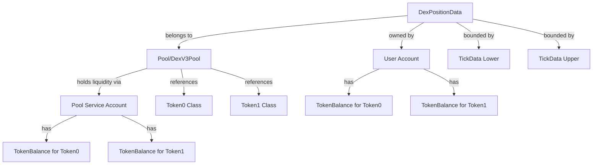

# DEX Chain Data Objects Analysis

## Core Chain Objects

### 1. Pool (DexV3Pool)
**Location**: `src/api/types/DexV3Pool.ts`

**Purpose**: Represents a liquidity pool for trading token pairs with concentrated liquidity (Uniswap V3-style).

**Key Structure**:
- **Chain Key Components** (composite key):
  - `token0`: Lexicographically first token identifier
  - `token1`: Lexicographically second token identifier 
  - `fee`: Fee tier (enum DexFeePercentageTypes)
  - Index Key: `GCDXCHLPL`

- **Token References**:
  - `token0ClassKey`: TokenClassKey for token0
  - `token1ClassKey`: TokenClassKey for token1

- **State Variables**:
  - `sqrtPrice`: Current square root price
  - `liquidity`: Active liquidity in current tick
  - `grossPoolLiquidity`: Total liquidity across all ticks
  - `feeGrowthGlobal0/1`: Accumulated fees per unit liquidity
  - `protocolFeesToken0/1`: Protocol fees collected

- **Critical Methods**:
  - `genPoolHash()`: Generates unique hash for pool identification
  - `getPoolAlias()`: Returns service account address that holds pool's tokens
    - Format: `service|pool_{poolHash}`
    - This is the actual wallet that holds all pool liquidity

### 2. DexPositionData
**Location**: `src/api/types/DexPositionData.ts`

**Purpose**: Represents an individual liquidity position within a pool.

**Key Structure**:
- **Chain Key Components**:
  - `poolHash`: References the parent pool
  - `tickUpper`: Upper price bound
  - `tickLower`: Lower price bound
  - `positionId`: Unique position identifier
  - Index Key: `GCDXCHLPDA`

- **Position State**:
  - `liquidity`: Amount of liquidity provided
  - `feeGrowthInside0Last/1Last`: Fee tracking for collection
  - `tokensOwed0/1`: Accumulated fees ready to collect
  - Token references and fee tier copied from pool

### 3. TickData
**Location**: `src/api/types/TickData.ts`

**Purpose**: Tracks liquidity and fee information at specific price points.

**Key Structure**:
- Linked to pool via poolHash
- Tracks liquidity changes at tick boundaries
- Manages fee growth outside tick ranges

## Object Relationships



## Balance Tracking Mechanism

### Pool Token Balances
Pools don't directly store token balances. Instead:

1. **Pool Service Account**: Each pool has a dedicated service account address
   - Generated via: `asValidUserAlias("service|pool_" + poolHash)`
   - This account holds all liquidity tokens

2. **TokenBalance Objects**: Standard GalaChain balance objects
   - Stored separately from Pool object
   - Linked via the pool's service account address
   - Accessed using `fetchOrCreateBalance(ctx, poolAlias, tokenClassKey)`

### Querying Pool Balances

To find the token balances for a pool (e.g., USDC|USDT):

```typescript
// Step 1: Get the pool object
const pool = await getObjectByKey(ctx, Pool, 
  ctx.stub.createCompositeKey(Pool.INDEX_KEY, [token0, token1, fee])
);

// Step 2: Get the pool's service account address
const poolAlias = pool.getPoolAlias(); // e.g., "service|pool_abc123..."

// Step 3: Fetch balance objects for each token
const token0Balance = await fetchOrCreateBalance(ctx, poolAlias, pool.token0ClassKey);
const token1Balance = await fetchOrCreateBalance(ctx, poolAlias, pool.token1ClassKey);

// Step 4: Get actual quantities
const token0Amount = token0Balance.getQuantityTotal();
const token1Amount = token1Balance.getQuantityTotal();
```

## Key Implementation Details

### Token Ordering
- Tokens are always ordered lexicographically (token0 < token1)
- Validated via `validateTokenOrder()` helper
- Ensures consistent pool identification

### Balance Updates
- All token transfers use GalaChain's `transferToken()` function
- Pool balances updated automatically through transfers
- No manual balance tracking in Pool object

### Fee Collection Flow
1. Fees accumulate in position's `tokensOwed0/1` fields
2. User calls `CollectPositionFees` to claim
3. Tokens transferred from pool service account to user

### Example: Swap Operation
```typescript
// During swap execution:
// 1. User sends tokenIn to pool service account
await transferToken(ctx, {
  from: ctx.callingUser,
  to: poolAlias,
  tokenInstanceKey: tokenInKey,
  quantity: amountIn
});

// 2. Pool sends tokenOut from service account to user
await transferToken(ctx, {
  from: poolAlias,
  to: ctx.callingUser,
  tokenInstanceKey: tokenOutKey,
  quantity: amountOut,
  authorizedOnBehalf: { callingOnBehalf: poolAlias, callingUser: poolAlias }
});
```

## Critical Insights

1. **Separation of Concerns**: Pool logic (pricing, liquidity) is separate from balance management
2. **Service Account Pattern**: Each pool has a dedicated wallet for token custody
3. **GalaChain Integration**: Leverages existing TokenBalance and transfer mechanisms
4. **Atomic Operations**: All balance changes happen through validated transfers
5. **No Direct Balance Storage**: Pool object doesn't store balances, only references

This architecture ensures:
- Consistency with GalaChain's token model
- Atomic balance updates
- Clear separation between DEX logic and token custody
- Reusability of existing GalaChain infrastructure